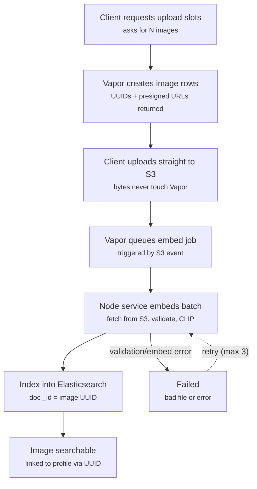
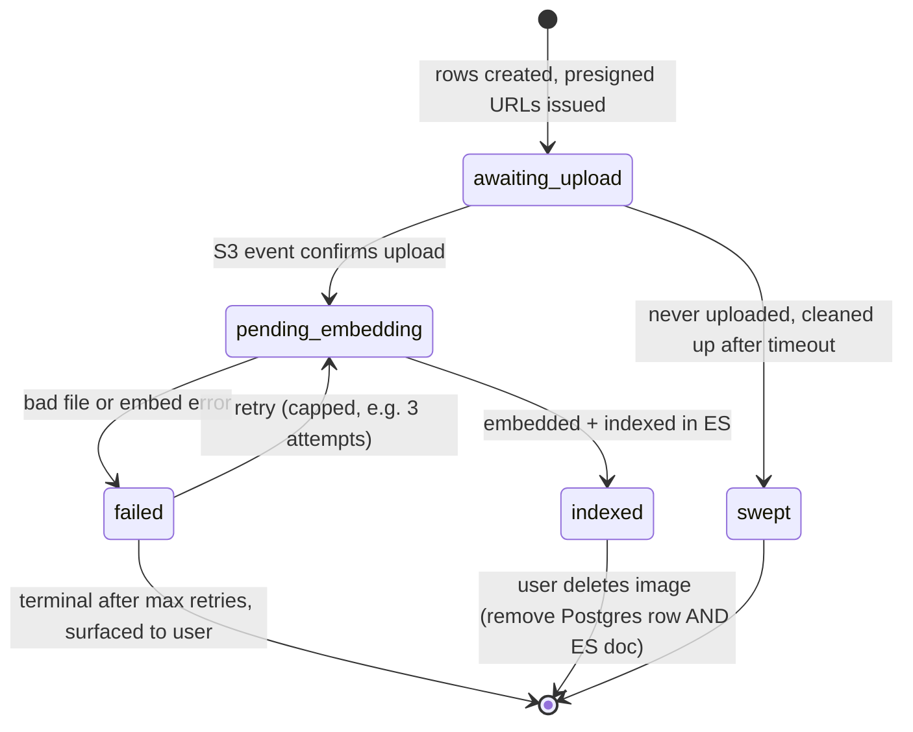

# Image Ingestion Flow

Architecture: Vapor (users/profiles, Postgres) + Node search service (CLIP embeddings, Elasticsearch). Images upload directly to S3 via presigned URLs; embedding happens asynchronously after upload.

## Ingestion pipeline

## `profile_images.status` lifecycle

## Notes

- **Postgres owns identity.** `profile_images.id` (UUID) is the canonical key; the ES document uses it as `_id`, making indexing idempotent. ES docs carry `profile_id` (denormalized) so search returns profile references without a round-trip.
- **ES is disposable.** Never store anything in ES that can't be rebuilt from Postgres + S3.
- **Deletes propagate.** Removing an image deletes both the Postgres row and the ES doc. A periodic reconciliation job compares `indexed` rows against ES doc IDs to catch drift.
- **Validation happens in the embed job.** Presigned URLs constrain content-type and max size; real validation (corrupt/non-image files) happens when the Node service downloads the file.
- **Truth = S3 object existence.** Prefer S3 event notifications over client "done" confirmations.
